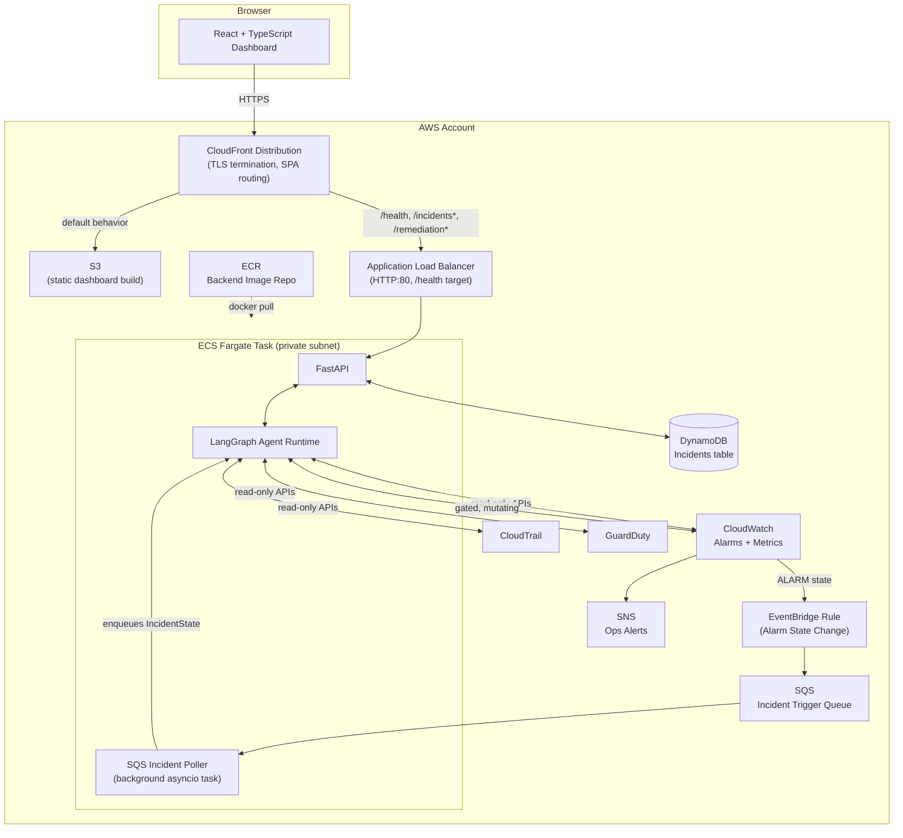
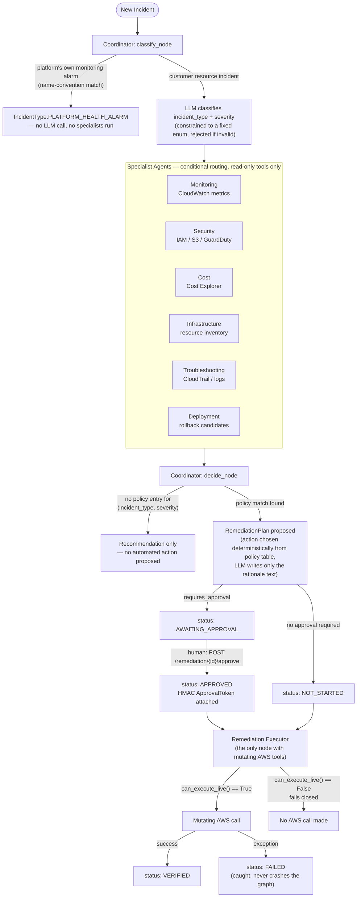
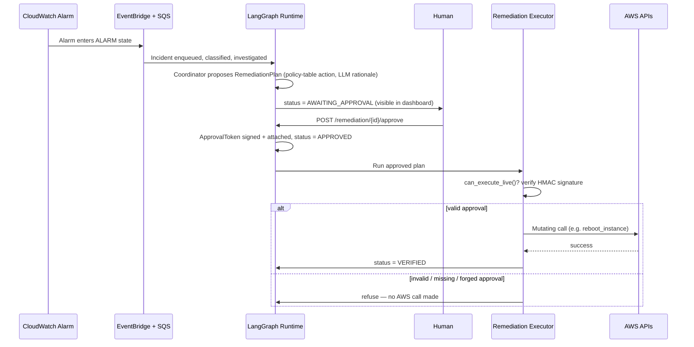

<div align="center">

# ☁️ CloudOps AI

### An agentic AI cloud engineer that watches AWS, diagnoses incidents, and remediates them under a human-gated approval workflow

*A multi-agent LangGraph system that behaves like a real on-call SRE: it detects, investigates, proposes a fix, waits for a human to approve anything that mutates AWS, executes it, and writes up exactly what happened and why.*

[](./LICENSE)
[](https://github.com/GeekyBlessing/cloudops-ai/actions/workflows/backend-ci.yml)
[](https://github.com/GeekyBlessing/cloudops-ai/actions/workflows/frontend-ci.yml)
[](https://github.com/GeekyBlessing/cloudops-ai/actions/workflows/terraform-plan.yml)


[Architecture](#architecture) · [AI Agent Workflow](#ai-agent-workflow) · [Security Model](#security-model) · [Getting Started](#getting-started) · [API Docs](#api-documentation) · [Roadmap](#roadmap)

</div>

---

---

## Table of Contents

- [What This Is](#what-this-is)
- [Why It's Built This Way](#why-its-built-this-way)
- [Architecture](#architecture)
- [AI Agent Workflow](#ai-agent-workflow)
- [AWS Services Used](#aws-services-used)
- [Security Model](#security-model)
- [Remediation Workflow](#remediation-workflow)
- [Terraform / Infrastructure](#terraform--infrastructure)
- [CI/CD](#cicd)
- [Getting Started](#getting-started)
- [Local Development](#local-development)
- [Docker](#docker)
- [API Documentation](#api-documentation)
- [Folder Structure](#folder-structure)
- [Testing & Code Quality](#testing--code-quality)
- [Roadmap](#roadmap)
- [Known Limitations](#known-limitations)
- [Contributing](#contributing)
- [License](#license)
- [Changelog](#changelog)

---

## What This Is

CloudOps AI is a portfolio project built to answer one question honestly: **can an AI agent be trusted anywhere near a real AWS account?** Not "can it write a summary of an alarm" can it detect a problem, investigate it the way an engineer would, decide on a fix, and be *physically incapable* of applying that fix without a human saying yes.

The system is a **LangGraph multi-agent graph** exposed over a **FastAPI** backend, with a **React + TypeScript** dashboard for humans to review incidents and approve or reject remediation. It runs on **ECS Fargate**, behind an **Application Load Balancer** and **CloudFront**, provisioned entirely by **Terraform** across three environments, deployed by **GitHub Actions** using OIDC (no long-lived AWS keys anywhere).

It is not a toy. It has a 99%-covered backend test suite, an HMAC-signed approval-token gate on the only code path that can mutate AWS, a deterministic policy allow-list that fails closed for anything it doesn't explicitly recognize, and three Terraform environments where only one is even allowed to touch real infrastructure. It is also not pretending to be bigger than it is - see [Known Limitations](#known-limitations) for what's genuinely missing.

## Why It's Built This Way

Three ideas run through every decision in this repo:

**The model reasons; code decides.** An LLM (via LangChain's provider-agnostic `BaseChatModel` interface - Claude, GPT-4o, or a local model are a config swap, not a code change) classifies incidents and writes the human-readable rationale for a proposed fix. It never chooses *which* AWS API to call. That choice always comes from a deterministic policy table (`domain/policies/remediation_policy.py`) keyed by `(incident_type, severity)`. There is no code path from "LLM output" to "AWS mutation" that skips that table.

**Read and mutate are different type-level capabilities, not just different IAM policies.** `tools/interfaces.py` defines `IReadOnlyAWSTools` and `IMutatingAWSTools` as separate Protocols. Every investigative agent (Monitoring, Security, Cost, Troubleshooting, Infrastructure) is only ever handed a read-only tool set,it is not possible for those agents to call a mutating method, because that method doesn't exist on the object they were given. Exactly one node in the entire graph, the Remediation Executor, is ever constructed with `IMutatingAWSTools`. This is enforced by the Python type system, not by convention.

**Safety is fail-closed by construction, not by configuration.** `RemediationPlan.can_execute_live()` requires a valid, HMAC-signed `ApprovalToken` bound to that exact plan's ID a forged or mismatched signature is rejected, and so is a plan whose status was somehow set to `APPROVED` without a token ever being attached (see `tests/unit/domain/test_remediation.py`). The remediation-mode default (`dry_run`) is hardcoded per Terraform environment file rather than exposed as a shared variable, specifically so it can't be flipped to `live` by a mistyped `-var` flag — changing it requires an actual reviewable diff.

## Architecture



**Why this shape, specifically:**

- **No separate trigger Lambda.** An earlier design considered a thin Lambda between EventBridge and SQS. What's actually built is simpler: EventBridge writes straight to SQS, and the same ECS task that serves the API runs an in-process background poller (`services/sqs_incident_poller.py`, started from `main.py`'s ASGI lifespan hook) that consumes it. One fewer moving part, one fewer IAM role, no cold-start latency to reason about appropriate at this project's scale.
- **CloudFront in front of both the static dashboard and the API**, not two separate endpoints. The ALB only has an HTTP:80 listener,no ACM certificate exists yet (see [Known Limitations](#known-limitations)). If the CloudFront-served (HTTPS) dashboard called that ALB directly, browsers would block every request as mixed content. Routing `/health`, `/incidents*`, and `/remediation*` through CloudFront too means the browser only ever speaks HTTPS to CloudFront; the one remaining plaintext hop is CloudFront→ALB, inside AWS's network, never the public internet.
- **DynamoDB as the single incident store**, accessed through a repository interface (`repositories/interfaces.py`) with two implementations a real `DynamoDBIncidentRepository` and an `InMemoryIncidentRepository` for tests — so the domain and agent logic never know or care which one is backing them.
- **ECS Fargate, not Lambda, for the agent runtime.** LangGraph runs can be multi-step and long-lived (waiting on a human approval mid-graph); a persistent container fits that model better than a function with a execution time limit.

## AI Agent Workflow

CloudOps AI's core loop is a **LangGraph `StateGraph`** (`agents/graph.py`) where every node reads and writes one shared, typed `IncidentState` (a Pydantic model, not a loose dict). Agents append to `evidence` and `agent_trace` rather than overwrite them the final incident record is a faithful reconstruction of what happened, not a summary that hides it.



**The agents** (all in `backend/src/cloudops_ai/agents/`):

| Agent | Core question it answers | Can mutate AWS? |
|---|---|---|
| **Coordinator** (`coordinator.py`) | What kind of incident is this, which specialists are relevant, and what's the final remediation call? | No |
| **Monitoring** (`monitoring_agent.py`) | What do the CloudWatch metrics say — is this an anomaly or normal noise? | No |
| **Troubleshooting** (`troubleshooting_agent.py`) | What sequence of events actually caused this? | No |
| **Security** (`security_agent.py`) | Is there an active security exposure (public bucket, over-permissive IAM, GuardDuty finding)? | No — flags only |
| **Cost** (`cost_agent.py`) | Is this resource idle or oversized? | No |
| **Infrastructure** (`infrastructure_agent.py`) | What does the resource actually look like right now? | No |
| **Deployment** (`deployment_agent.py`) | Is this a bad deploy, and is a rollback the right call? | No |
| **Remediation Executor** (`remediation_executor.py`) | Execute the approved plan and report success or failure | **Yes — the only one** |

A deterministic short-circuit in `classify_node` recognizes this project's *own* monitoring alarms (ECS CPU/memory, SQS DLQ depth, poller staleness) by name convention and classifies them as `PLATFORM_HEALTH_ALARM` before any LLM call — this exists because `infra/modules/eventbridge`'s alarm rule is intentionally unscoped (it has to catch any CloudWatch alarm, including the platform's own), and asking an LLM to force-fit a platform alarm into a customer-resource incident type (e.g., guessing an ECS CPU alarm is `EC2_HIGH_CPU`) produced a plausible-looking but wrong investigation. See `coordinator.py`'s docstring for the full story — this was a real bug found and fixed during development, not a hypothetical.

## AWS Services Used

| Service | Role in this system |
|---|---|
| **ECS Fargate** | Runs the FastAPI + LangGraph runtime container in a private subnet, behind the ALB. No public IP on the task. |
| **Application Load Balancer** | Only public-facing compute entry point. Health-checks against `/health`. Terminates nothing (HTTP-only today — see [Known Limitations](#known-limitations)). |
| **CloudFront** | Terminates TLS for the whole system with its default certificate; dual-origin (S3 for the dashboard, ALB for API paths) so the browser only ever speaks HTTPS. Runs a CloudFront Function for SPA client-side-routing fallback, scoped only to the S3 behavior so it can't rewrite a real API 404 into a 200. |
| **S3** | Hosts the built React dashboard as a private, OAC-secured origin behind CloudFront. |
| **DynamoDB** | Single source of truth for incident records (`Incidents` table), accessed through a repository interface with pagination support for `list_all()`. |
| **EventBridge** | Rule matching CloudWatch alarm state changes (`ALARM`), writing incidents onto the SQS queue — the automated entry point alongside the dashboard's manual "new incident" form. |
| **SQS** | Decouples alarm ingestion from processing; consumed by an in-process poller inside the backend container, with retry/backoff handling on transient failures. |
| **CloudWatch** | Alarms and metrics — both the resource being investigated (`get_metric_data` for CPU utilization, etc.) and the platform's own health (ECS CPU/memory, DLQ depth, poller staleness), the latter feeding an SNS topic. |
| **CloudTrail** | Read-only event lookup for the Troubleshooting Agent's root-cause analysis, and the independent, tamper-evident record of what the Remediation Executor's role actually did. |
| **GuardDuty** | Findings feed into incident triage via the SQS poller and the Security Agent. |
| **IAM** | Least-privilege roles scoped to the *exact* boto3 calls each tool gateway makes (`MonitoringReadOnlyRole`, `RemediationExecutorRole`), not broad service-level access. OIDC federation for GitHub Actions — no long-lived AWS access keys stored anywhere. |
| **ECR** | Backend Docker image repository — immutable tags, scan-on-push, lifecycle policy for untagged images. |
| **SNS** | Ops-alert delivery for the platform's own CloudWatch alarms. |
| **VPC** | Custom networking (not the default VPC) — public subnets for the ALB, private subnets for ECS, one NAT gateway *per Availability Zone* so a private subnet's egress only ever depends on its own AZ's infrastructure. |

## Security Model

This is the section a security-focused reviewer should read first.

- **Type-level separation of read and mutate.** `IReadOnlyAWSTools` and `IMutatingAWSTools` are separate Protocols (`tools/interfaces.py`). Six of the eight nodes in the graph are only ever constructed with a read-only tool set — calling a mutating method on them isn't a permissions error, it's a `AttributeError` at the type level, because the method doesn't exist on the object.
- **A single, small, heavily-tested mutation gateway.** `remediation_executor.py` is the only place `IMutatingAWSTools` is ever invoked. It's ~50 statements, 100% test-covered, and every action it can take is looked up from a fixed `_ACTION_INVOKERS` mapping — an action name with no entry raises and fails the plan closed rather than doing something undefined.
- **HMAC-signed approval tokens, not a status flag.** `ApprovalToken.sign()`/`.verify()` (`domain/models/remediation.py`) uses `hmac.compare_digest` (constant-time comparison, avoiding a timing side-channel) and binds the signature to a specific `plan_id`an approval for one plan cannot be replayed against another. A `model_validator` rejects constructing a `RemediationPlan` whose attached approval's `plan_id` doesn't match at all, as a second, independent guard.
- **Fails closed, everywhere.** `RemediationPlan.can_execute_live()` returns `False` for: a plan that doesn't require approval and isn't in scope for live execution's default; a plan not in `APPROVED` status; a plan with no approval attached at all, even if status somehow reached `APPROVED`; and a plan whose approval fails HMAC verification. Every one of these branches has an explicit test (`tests/unit/domain/test_remediation.py`).
- **A deterministic, fail-closed action allow-list.** `domain/policies/remediation_policy.py` maps `(incident_type, severity) → allowed_actions`. Any pair not explicitly listed gets no proposed remediation at all — a report-only recommendation, never a guess.
- **Dry-run by default, everywhere except one named environment.** `CLOUDOPS_REMEDIATION_MODE` is `dry_run` in `environments/dev` and `environments/staging`, and `live` only in `environments/demo-live` — hardcoded per Terraform file, not a shared variable, specifically so it can't be flipped by a mistyped `-var` flag at apply time (see [Terraform / Infrastructure](#terraform--infrastructure)).
- **No long-lived AWS credentials.** GitHub Actions authenticates via OIDC federation to two distinct IAM roles — a read-only plan role usable by any PR, and a broad-write deploy role usable only via a manually-triggered, environment-gated workflow (see [CI/CD](#cicd)).
- **API-key authentication on every backend route** (`CLOUDOPS_API_KEY`), enforced via a FastAPI dependency with its own dedicated test coverage (`tests/unit/api/test_dependencies.py`, `test_auth.py`).

## Remediation Workflow



Every step appends an `AgentStep` to the incident's `agent_trace` with its own reasoning text — the report isn't a summary generated after the fact, it's the actual sequence of what each agent did and why, reconstructable from DynamoDB alone.

## Terraform / Infrastructure

Nine modules (`infra/modules/`), wired together into three near-identical environments (`infra/environments/{dev,staging,demo-live}`):

| Module | Provisions |
|---|---|
| `networking` | Custom VPC, 2 AZs, public + private subnets, Internet Gateway, one NAT gateway *per AZ*, route tables |
| `dynamodb` | The `Incidents` table |
| `iam` | Least-privilege roles matching the read-only/mutating tool boundary, ECS task execution role, SQS consume permissions |
| `ecs` | Fargate cluster, task definition, service — private subnets, no public IP |
| `ecr` | Backend image repository — immutable tags, scan-on-push |
| `eventbridge` | CloudWatch-Alarm-state-change rule feeding the SQS incident queue |
| `monitoring` | SNS alerts topic, CloudWatch alarms on the platform's own health, a summary dashboard |
| `alb` | Application Load Balancer, target group, HTTP:80 listener |
| `frontend` | S3 bucket + CloudFront dual-origin distribution + Origin Access Control + SPA-routing CloudFront Function |

**Why three environments are near-identical file copies, not one parameterized module:** `CLOUDOPS_REMEDIATION_MODE` is hardcoded directly inside each environment's `main.tf` — `dry_run` for `dev`/`staging`, `live` only for `demo-live`. A shared variable could be overridden by anyone's typo or bad copy-paste at apply time (`-var="remediation_mode=live"` against `dev`, say); a value that only exists inside `environments/demo-live/main.tf` cannot leak into another environment without a real, reviewable file diff. The duplication cost (a module change has to be copied into three files by hand) was judged worth it for that guarantee.

Full rationale for every module, IAM permission list, and manual deployment steps live in [`infra/README.md`](./infra/README.md) — including a candid note about which chunk of this project could *not* be verified with a real `terraform plan` (network restrictions in the build sandbox blocked the provider download) and exactly what to run yourself to confirm it.

## CI/CD

Four GitHub Actions workflows (`.github/workflows/`):

- **`backend-ci.yml`** — `ruff check` (lint) → `mypy --strict` (type-check) → `pytest` with coverage, on every push/PR touching `backend/`.
- **`frontend-ci.yml`** — `eslint` → `tsc --noEmit` (type-check) → build, on every push/PR touching `frontend/`.
- **`terraform-plan.yml`** — runs `terraform plan` on any PR touching `infra/`, so infrastructure changes are reviewed before merge, not after.
- **`deploy.yml`** — **`workflow_dispatch`-only, not automatic on merge to `main`.** Builds the backend image, pushes it to ECR tagged with the triggering commit's SHA, runs `terraform apply`, syncs the built dashboard to S3, and invalidates the CloudFront cache. Deliberately mirrors the project's human-gated-by-default posture elsewhere — deploying to a real AWS account shouldn't happen silently on every merge.

All AWS authentication is via **OIDC federation** — two distinct IAM roles, one read-only (used by `terraform-plan.yml`, runs on every PR from any branch) and one broad-write (used only by the manually-triggered `deploy.yml`). No AWS access keys are stored as GitHub secrets anywhere in this repo.

## Getting Started

**Prerequisites:** Python 3.12+, Node 18+, [`uv`](https://docs.astral.sh/uv/), Docker (for local DynamoDB + full-stack Docker Compose), and an AWS account only if you want to deploy real infrastructure (everything runs against mocks/DynamoDB Local without one).

```bash
git clone https://github.com/GeekyBlessing/cloudops-ai.git
cd cloudops-ai
```

## Local Development

**Backend:**

```bash
cd backend
uv sync --all-extras
uv run pytest                 # 99% coverage, ~169 tests, no AWS account needed
uv run ruff check .
uv run mypy src
uv run uvicorn cloudops_ai.main:app --reload
```

**Frontend** (in a second terminal):

```bash
cd frontend
npm install
cp .env.example .env.local    # adjust VITE_API_BASE_URL if needed
npm run dev                   # http://localhost:5173
```

The dashboard will show a fetch error until the backend is running — that's expected, not a bug.

## Docker

The full stack — DynamoDB Local, a one-shot table-creation job, the backend, and the frontend — comes up with one command:

```bash
docker compose up --build
```

| Service | What it does |
|---|---|
| `dynamodb-local` | In-memory DynamoDB Local (`amazon/dynamodb-local`) |
| `dynamodb-init` | Runs `scripts/create_local_tables.py` once, then exits |
| `backend` | FastAPI + LangGraph runtime, `CLOUDOPS_REMEDIATION_MODE=dry_run`, talking to DynamoDB Local |
| `frontend` | Production build served by nginx, built with `VITE_API_BASE_URL=http://localhost:8000` |

Backend on `:8000`, frontend on `:3000`.

## API Documentation

The backend is FastAPI, so interactive OpenAPI docs are auto-generated at `/docs` (Swagger UI) and `/redoc` whenever it's running. Route groups, all under `backend/src/cloudops_ai/api/routers/`:

| Router | Endpoints |
|---|---|
| `incidents.py` | List and retrieve incidents, including their full evidence and agent-trace history |
| `remediation.py` | Retrieve a proposed plan, `POST /remediation/{id}/approve`, `POST /remediation/{id}/reject` |

All routes require the `CLOUDOPS_API_KEY` header, enforced by a shared FastAPI dependency (`api/dependencies.py`). CORS origins are configured via `CLOUDOPS_CORS_ORIGINS`.

## Folder Structure

```
cloudops-ai/
├── .github/workflows/        backend-ci, frontend-ci, terraform-plan, deploy
├── backend/
│   ├── src/cloudops_ai/
│   │   ├── agents/           coordinator, 6 specialists, remediation_executor, graph.py
│   │   ├── domain/           enums, Pydantic models, remediation policy table — zero AWS/framework imports
│   │   ├── tools/            IReadOnlyAWSTools / IMutatingAWSTools protocols + real/dry-run adapters
│   │   ├── adapters/mock/    in-memory AWS gateway for tests and local dev
│   │   ├── repositories/     DynamoDB + in-memory incident repositories, behind one interface
│   │   ├── services/         approval_service, sqs_incident_poller
│   │   ├── api/               FastAPI routers + auth dependency
│   │   └── core/              pydantic-settings config, structlog logging
│   └── tests/unit/            99% coverage, zero real AWS calls (moto + hand-mocked boto3 attributes)
├── frontend/src/
│   ├── pages/                  IncidentListPage, IncidentDetailPage
│   ├── components/             StatusBadge, EvidenceList, AgentTraceList, ApiKeyControl
│   └── api/                    typed REST client + API-key storage
├── infra/
│   ├── modules/                 9 modules — see Terraform section above
│   └── environments/            dev, staging, demo-live
├── docs/
│   └── ARCHITECTURE.md          deep-dive design rationale
└── docker-compose.yml            full local stack: DynamoDB Local + backend + frontend
```

## Testing & Code Quality

- **99% backend statement coverage** (1,221 statements, 3 missing — both remaining gaps are documented, hard-to-reach defensive branches in `api/dependencies.py` and the boto3 gateway, not neglected code).
- **~169 backend unit tests**, zero real AWS calls — `moto` for AWS API mocking plus hand-written `MagicMock` patching where moto's fidelity has known gaps (e.g., GuardDuty's `ListFindings`), and an in-memory `MockAWSGateway` fixture for agent-level tests.
- **`ruff` (lint) and `mypy --strict` (type-check)** enforced in CI on every push.
- **`pytest-asyncio` in strict mode** — every async test is explicitly marked, no implicit event-loop magic.

## Roadmap

- [ ] Register a domain, add an ACM certificate, and give the ALB an HTTPS listener (currently HTTP-only behind CloudFront — see [Known Limitations](#known-limitations))
- [ ] Extend the remaining incident types' specialist coverage with real integration tests against LocalStack
- [ ] Add a WebSocket or polling live-activity feed to the dashboard (today the detail page refreshes on demand only)
- [ ] Incident report generation (the data model supports it; the generation step isn't implemented yet)
- [ ] Chase the final 1% of backend coverage in `api/dependencies.py` / `boto3_aws_gateway.py`

## Known Limitations

Said plainly, because a senior engineer's documentation says what's missing, not just what's built:

- **No TLS/custom domain yet.** The ALB's listener is HTTP-only; CloudFront (using its default certificate) is what actually gives the dashboard real HTTPS today. See `infra/README.md`'s "TLS/HTTPS and a custom domain" section for the exact plan once a domain is registered.
- **API-key auth, not OAuth/JWT.** Fine for a single-operator portfolio system; a multi-user real product would need real identity, not a shared secret header.
- **No live/streaming updates.** The dashboard fetches on load and on explicit user action — no WebSocket push yet.
- **`IncidentReport` generation isn't implemented.** The model exists (`domain/models/report.py`); nothing populates it yet.
- **Single-region.** No multi-region or multi-account support — an explicit v1 non-goal, not an oversight.

## Contributing

See [`CONTRIBUTING.md`](./CONTRIBUTING.md) for local setup, coding standards, and how test coverage expectations work in this repo.

## License

[MIT](./LICENSE) — see the LICENSE file for the full text.

## Changelog

See [`CHANGELOG.md`](./CHANGELOG.md) for a full history of changes, or `git log` for the unabridged version.

---

<div align="center">

Built by [Toriola](https://github.com/GeekyBlessing) as a deep dive into what "an AI agent that's actually allowed near production AWS" has to get right.

</div>
